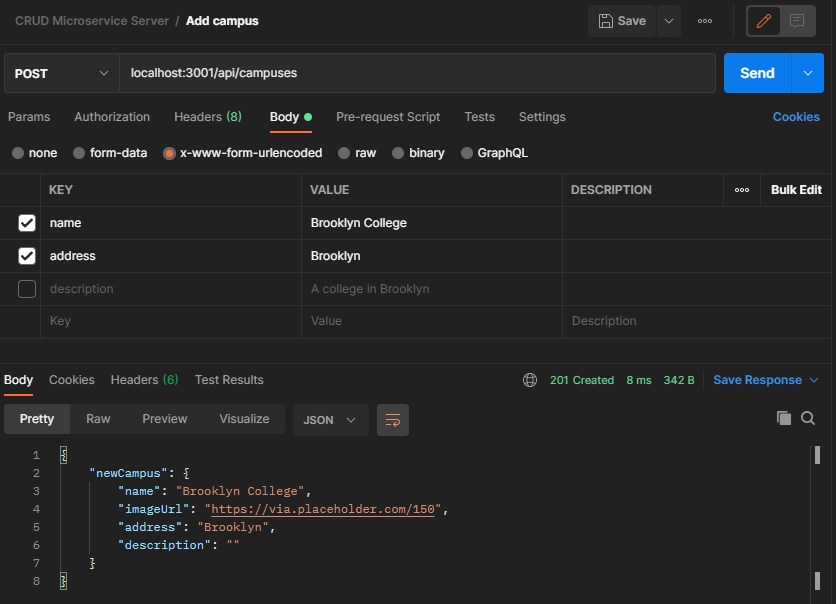
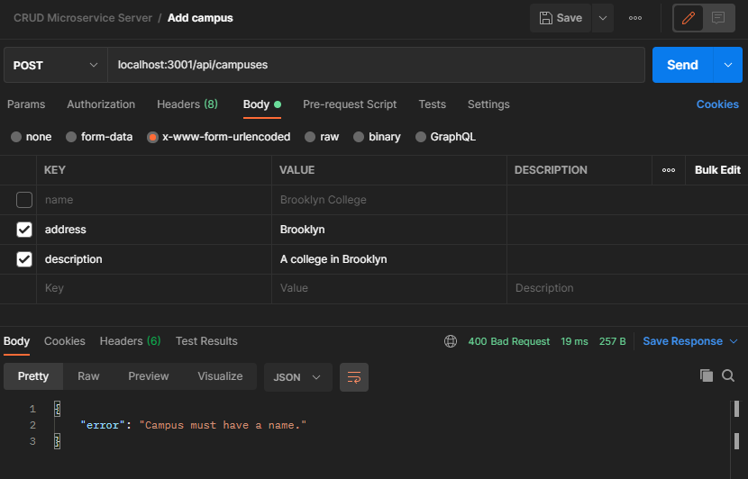
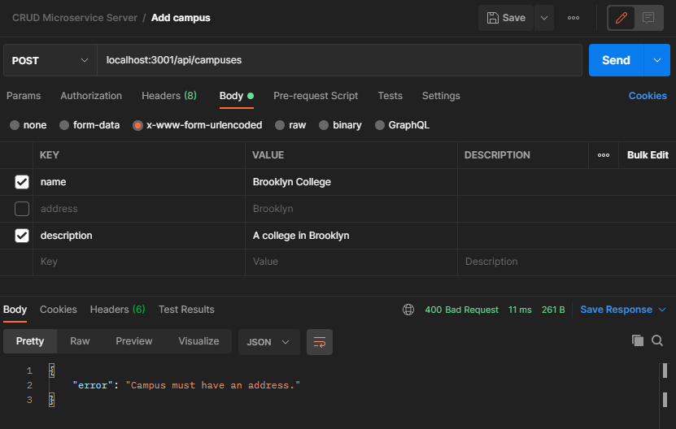
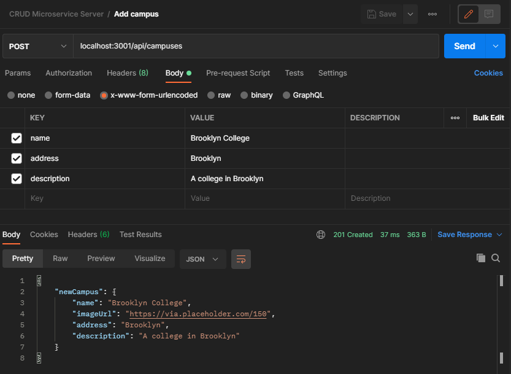

# Reflection

## Self Assessment
Are you able to tell what you were working on with your old code? Why or why not?
- Yes, there are comments throughout the code, and much of it is self-documenting.

Do you know why you implemented your solution a certain way?
- It was the way I had learned to do during the CUNY TTP program.

How long did it take you? What resources did you use?
- Over a span of 3-4 days, right after ~3 weeks of training.

## Reflection
What do you know now that you didn't know before?
- Since the last time I've worked on the old project, I've learned a bit about architectural design from working on open-source projects. I've also learned more about clean OOP design principles, which includes concepts such as dependency injection and separation of concerns.

What has changed about your technique when approaching programming projects?
- Instead of approaching and implementing a solution head-on, I decided to approach from an architectural standpoint and learn something new in the process. I decided to go with a clean microservice architecture that focuses on reducing the reliance on third-party dependencies and instead inject dependencies through multiple layers of responsibilities.

Which programming languages did you use to solve the problem(s)? Why did you choose a particular language?
- I chose JavaScript since it's a popular language for web development, and the language I'm currently most comfortable with. My previous project was also written in JavaScript and used some JavaScript frameworks and dependencies. Instead of going through the trouble of trying to familiarize myself with a new language, I decided to use a familiar language and focus on improving the architecture of my project. 

### Evaluating Choices
Was there any difficulty or ease with using that language for solving the problem?
- I had no difficulty in reusing JavaScript and the frameworks of the previous project (Express, Node.js), but I did have trouble adapting to and learning a new architecture in an attempt to solve the same problems in a short period of time.

What was your approach to writing that code? Try to think about how you started the coding process... such as did you first think of variables needed or did you break up the data flow into the functions? Did you work by trial and error or did you plan/pseudocode prior to beginning to code?
- Since I was unfamiliar with microservice architecture, I followed a [tutorial](https://www.youtube.com/watch?v=CnailTcJV_U) and tried to follow the [source code](https://github.com/dev-mastery/comments-api) as close as possible, but also keeping it minimal to my use case. Since this particular architecture primarily deals with dependency injection, I followed the data flow from each layer of responsibility to see if the end result was what I expected.


### Future Steps
If you had to solve the problem again, would you choose the same language or a different language?
- I would choose the same language and focus on getting accustomed to this new architecture, optimizing it further if needed. I would also experiment with different frameworks to see which ones are easiest to work with and implement.

Would you organize the code differently? How so?
- It's hard to say at this point, as I've only spent a few days learning new concepts and implementing them myself. Over time, through trial and error, I would probably have my own style of organization, optimized to my own needs, so it's highly likely the current structure would change.

## End Result

### Converting Models to Entities
As described in [ARCHITECTURE.md](ARCHITECTURE.md), entities are designed to have no dependencies that are explicitly required or imported. Instead, they receive dependencies via dependency injection, such that the implementation details are not exposed. This allows the dependencies to be used without worry about how they are implemented, as long as the required tests pass. Developers can easily swap out libraries for certain business logic without touching entity code, thus enabling the application to be easily scalable.

([Old Code](https://github.com/cisc3160-PL/campus-crud-server/blob/master/database/models/campus.js)) Here, we can see that the `Campus` model depends on Sequelize ORM to define legal attributes and constraints, and also a database object to define the model. If either `Sequelize` or `db` fail, this model is going to fail as well.
```js
/**
 * Create a campus model with attributes and constraints
 */

const Sequelize = require("sequelize");
const db = require("../db");

const Campus = db.define("campus",
{
    name: 
    { 
        type: Sequelize.STRING, 
        allowNull: false 
    },
    imageUrl:
    {
        type: Sequelize.STRING,
        defaultValue: "https://via.placeholder.com/150"
    },
    address:
    {
        type: Sequelize.STRING,
        allowNull: false
    },
    description:
    {
        type: Sequelize.TEXT,
        defaultValue: "",
        allowNull: false
    }
});

module.exports = Campus;
```

([New Code](https://github.com/cisc3160-PL/crud-server/blob/main/src/entities/campus/campus.js)) Here, there are no dependencies at all. This is pure JavaScript code, and we can see that the function in charge of creating a new campus object also handles the business logic to validate its parameters. This is extremely beneficial to the development process, because it is guaranteed for business logic errors to be caught during campus creation, and not at runtime when some other service finds out that the campus object is in an invalid state.
```js
module.exports = buildCreateCampus = () =>
{
    return createCampus = ({
        name,
        imageURL,
        address,
        description
    } = {}) =>
    {
        if(!name) throw new Error('Campus must have a name.');
        if(!address) throw new Error('Campus must have an address.');

        return Object.freeze({
            getName: () => name,
            getImageURL: () => imageURL || 'https://via.placeholder.com/150',
            getAddress: () => address,
            getDescription: () => description || ''
        });
    };
};
```

### Writing Use Cases for Entities
Going up a layer, we have use cases for entities, which govern the valid interactions within the application. Since microservice architecture drives dependencies inward, the Use Case layer has a dependency on entities. Much like entities, and the layers above, dependencies from adapters are injected into this layer, which are then injected into entities.

([Old Code](https://github.com/cisc3160-PL/campus-crud-server/blob/master/routes/campuses.js#L58-L79)) There is a lot going on at once in this snippet of code. There are dependencies on the Express web framework, the `Campus` model, handling of HTTP requests, all in the same place. As stated in the previous snippet, if Sequelize or db fails, then the models will fail. And if the models fail, or if Express fails, then the following code will fail as well. The risk of error and consequences of failure cascades upward, stunting the entire application in the process. Also note that Express is tightly coupled with the route implementation, so attempting to switch to another web framework would mean changing the entire implmentation.
```js
/**
 * Here, we can set up the routes for campuses
 */

var express = require("express");
var router = express.Router();

const { Campus } = require("../database/models");

/**
 * POST (add) a single campus
 * /api/campuses/
 */
router.post("/", async (req, res, next) =>
{
    Object.keys(req.body).forEach((key) => (req.body[key] === "") ? delete req.body[key] : req.body[key]);

    try
    {
        // Create a new campus on the database
        const newCampus = await Campus.create(req.body);
        
        // The database should return a campus
        // Send that campus as a json to the client
        res.status(201).send(newCampus);
    }
    catch(err)
    {
        next(err);
    }
});

module.exports = router;
```

([New Code](https://github.com/cisc3160-PL/crud-server/blob/main/src/use-cases/campus/add-campus.js)) Here, we have a use case `addCampus` which depends on the `createCampus` entity. `buildAddCampus` is injected with a `campusDB` dependency to handle interactions with the database, and `addCampus` receives some `campusInfo` data to create a new campus with. The implementation of `campusDB` is not known to this use case, and the contents of `campusInfo` is unknown as well. All the use case knows is that `campusInfo` is what `createCampus` needs to create a new campus, and `campusDB` can be used to insert the campus data to the database. If `campusInfo` contains invalid data, the `createCampus` entity will be able to detect the errors. If `campusDB` fails to do its job, it can be swapped or modified behind the scenes without ever needing to modify the use case.
```js
const createCampus = require('../../entities/campus');

module.exports = buildAddCampus = ({ campusDB }) =>
{
    return addCampus = async (campusInfo) =>
    {
        const campus = createCampus(campusInfo);

        return campusDB.insert({
            name: campus.getName(),
            imageUrl: campus.getImageURL(),
            address: campus.getAddress(),
            description: campus.getDescription()
        })
    }
}
```

### Controllers for HTTP Requests
Going up yet another layer, adapters are used to convert data between the layers into a more convenient format. Data from the use cases and entities could be converted to be compatible with external frameworks (database or web), and external data could be converted to be compatible with use cases and entities.

([Old Code](https://github.com/cisc3160-PL/campus-crud-server/blob/master/routes/campuses.js#L58-L79)) Using the same example as above, this snippet of code handles HTTP requests with other unrelated tasks, making it prone to errors.
```js
/**
 * POST (add) a single campus
 * /api/campuses/
 */
router.post("/", async (req, res, next) =>
{
    Object.keys(req.body).forEach((key) => (req.body[key] === "") ? delete req.body[key] : req.body[key]);

    try
    {
        // Create a new campus on the database
        const newCampus = await Campus.create(req.body);
        
        // The database should return a campus
        // Send that campus as a json to the client
        res.status(201).send(newCampus);
    }
    catch(err)
    {
        next(err);
    }
});
```

([New Code](https://github.com/cisc3160-PL/crud-server/blob/main/src/controllers/campus/post-campus.js)) Quite similar to the `addCampus` use case, the `postCampus` controller handles HTTP requests and converts request data into usable bits for the  use case. It has no knowledge of any entity, nor does it know if or where the data is being persisted. Its only job is to convert HTTP request data into usable chunks.
```js
module.exports = buildPostCampus = ({ addCampus }) =>
{
    return postCampus = async (httpRequest) =>
    {
        try
        {
            const { ...campusInfo } = httpRequest.body;
            const newCampus = await addCampus({ ...campusInfo });

            return {
                headers: {
                    'Content-Type': 'application/json'
                },
                statusCode: 201,
                body: { newCampus }
            }
        }
        catch(err)
        {
            console.error(err);

            return {
                headers: {
                    'Content-Type': 'application/json'
                },
                statusCode: 400,
                body: {
                    error: err.message
                }
            }
        }
    }
};
```

### Adapter for Database
Still in the same layer as controllers, adapters for databases can be written here. The design for an adapter is to enable a universal connection to any type of database in the use case layer without worrying about implementation details or function names changing. If a different database or a different type of database (relational vs document) needs to be used, it can be easily swapped out. All the developer needs to do is to update the adapter's implementation.

([Old Code](https://github.com/cisc3160-PL/campus-crud-server/blob/master/routes/campuses.js#L58-L79)) The same example again; we can see how the new campus is being created by accessing the `Campus` model, but is at risk of failure at multiple fronts.
```js
/**
 * POST (add) a single campus
 * /api/campuses/
 */
router.post("/", async (req, res, next) =>
{
    Object.keys(req.body).forEach((key) => (req.body[key] === "") ? delete req.body[key] : req.body[key]);

    try
    {
        // Create a new campus on the database
        const newCampus = await Campus.create(req.body);
        
        // The database should return a campus
        // Send that campus as a json to the client
        res.status(201).send(newCampus);
    }
    catch(err)
    {
        next(err);
    }
});
```

([New Code](https://github.com/cisc3160-PL/crud-server/blob/main/src/database/campus-db.js)) So far, these are just stubs in place of the actual implementation, which highlights another useful feature of microservice architecture. Dependencies can be defined before their implementations are complete. This way, more focus can go towards developing the business logic rather than implementing all necessary dependencies. Since the function names are determined by the developer, the implementation can be modified to adapt to any variety of database without modifying the inner layers. In this particular example, I just returned the same data that was received in `insert` from use case `addCampus`, just so it doesn't throw any errors at runtime.
```js
module.exports = buildCampusDB = ({ createDB }) =>
{
    return Object.freeze({
        findById,
        insert
    });

    async function findById({ id: _id })
    {
        
    };

    async function insert({ ...info })
    {
        return { ...info };
    };
};
```

### The Final Glue: Frameworks and Drivers
At the outermost layer, this is where we can connect to third-party dependencies, such as databases (PostgreSQL, MongoDB) and web frameworks (Express). Not much code is written here other than to connect external existing code to inner layers.

([Old Code](https://github.com/cisc3160-PL/campus-crud-server/blob/master/app.js)) Just look at all those dependencies at the top of the file. If any one of them fail the entire application is done for.
```js
/**
 *  Here, we will sync our database, create our application, and export this 
 *  module so that we can use it in the bin directory, where we will be able to 
 *  establish a server to listen and handle requests and responses
 */

// Load environmental variables from .env file
require("dotenv").config();

var express = require('express');
var path = require('path');
var cookieParser = require('cookie-parser');
var logger = require('morgan');
var helmet = require("helmet");
var compression = require("compression");

// Utilities
const createLocalDatabase = require("./utils/createLocalDatabase");
const seedDatabase = require("./utils/seedDatabase");

// Our database instance
const db = require("./database");

...

// Instantiate our express application
const app = express();

...

// Main function declaration
const bootApp = async () =>
{
    await syncDatabase();
    await configureApp();
};

// Main function invocation
bootApp();

// Export our app, so that it can be imported in the www file
module.exports = app;
```

([New Code](https://github.com/cisc3160-PL/crud-server/blob/main/src/index.js)) Compared to the old code, we have far less third-party dependencies, only needing `dotenv` and `express`. `postCampus` is written by the developer and has dependencies injected into it, so we know it is safe to use. `buildCallback` is an Express callback function that has been written to connect controllers to routes. It is an outer layer driver that receives HTTP requests and passes the information down to controllers. Note that connecting the callback driver to our routes via Express is making Express depend on our code, not the other way around.
```js
require('dotenv').config();
const express = require('express');
const { postCampus } = require('./controllers/campus');
const buildCallback = require('./express-callback');

const apiRoot = process.env.API_ROOT || '/api';
const server = express();

server.use(express.json());
server.use(express.urlencoded({ extended: false }));
server.get('/', (req, res) => res.send('CRUD Microservice Server'));

// Campus routes
server.post(`${apiRoot}/campuses`, buildCallback(postCampus));

module.exports = server;
```

### Making Requests via Postman
Successful request


Failed request: campus with no name (entity handles error)


Failed request: campus with no address (entity handles error)


Successful request: optional description
